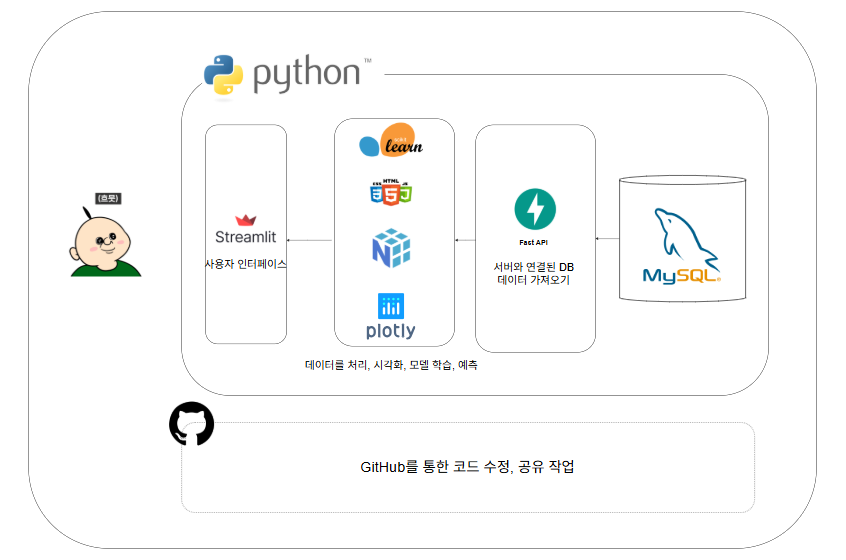
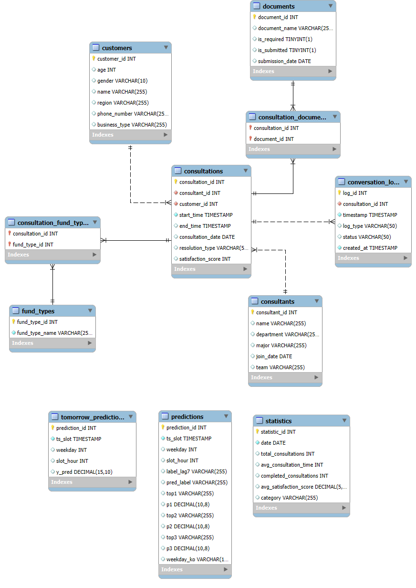

# wh07-2nd-Tooktook
## LG U+ Why Not SW Camp 7기 툭툭 레포지토리 입니다.

  
  
   
  <em style="font-size: 13px; color: gray;">* GPT 기반 이미지 생성 툴을 활용해 제작된 캐릭터입니다.</em>

--- 

# 1. 프로젝트 정의
- 목표   
  - 상담 이력 데이터를 활용해 상담 수요 패턴을 예측하고, 상담사/관리자용 인사이트를 제공하는 대시보드를 구축한다.

- 주요 기능
  - 상담 데이터 수집 및 전처리
  - 상담 현황 시각화 및 보고서 제공
  - 머신러닝 기반 상담 건수 예측 및 자금유형 추천

# 2. 주요 내용
- 프로젝트 기간: 2025-08-25 ~ 2025-08-29
- 참여 인원: 

  <table>
    <tr>
      <th>이정석</th>
      <th>박상준</th>
      <th>한지훈</th>
      <th>홍가연</th>
    </tr>
    <tr>
      <td></td>
      <td></td>
      <td></td>
      <td></td>
    </tr>
    <tr>
      <td align="center"></td>
      <td align="center"></td>
      <td align="center"></td>
      <td align="center"></td>
    </tr>
  </table>

- 데이터 출처: 팀 내 구축한 상담 이력 데이터셋 (상담 로그, 상담 유형, 상담 시간대 등)

# 3. 일정 계획
## 🔹 작업 분할 구조 (WBS)

1. 데이터 정의 및 요구사항 분석
    - 1.1 데이터 정의
    - 1.2 상담 이력 데이터 검토

2. 데이터 수집 및 설계
    - 2.1 아키텍처 설계
    - 2.2 데이터 수집 및 전처리

3. 분석 및 보고
    - 3.1 데이터 검증 및 모델링
    - 3.2 대시보드 및 보고서 작성

4. 파일 임베딩
    - 4.1 파일 크롤링 (소상공인 진흥공단)
    - 4.2 파일 텍스트 변환
    - 4.3 텍스트 청킹/임베딩
    - 4.4 벡터 DB 적재

# 4. 프로젝트 설계서
📌 데이터 아키텍처 개요

  - 데이터 수집: Python (가상데이터 생성)
  - 데이터 저장: CSV/DB (MySQL)
  - 분석 및 시각화: Pandas, NumPy, Plotly, Streamlit

📌 기술 스택

  - 데이터 수집: Python
  - 분석 및 처리: Pandas, NumPy, scikit-learn
  - 시각화: Plotly, Seaborn
  - ui: Streamlit

📌 아키텍처 다이어그램

  

# 5. 데이터 연동 정의서
- 데이터: 상담 이력 데이터

  
  <em style="font-size: 10px; color: gray;">ERD Diagram</em>

- 테이블 설명
    

      <table border="1">
        <tr>
          <th>테이블명</th>
          <th>설명</th>
        </tr>
        <tr>
          <td>consultants</td>
          <td>상담사 정보</td>
        </tr>
        <tr>
          <td>consultation_documents</td>
          <td>상담에 쓰인 필요 서류</td>
        </tr>
        <tr>
          <td>consultation_fund_types</td>
          <td>상담한 자금 유형</td>
        </tr>
        <tr>
          <td>consultations</td>
          <td>상담 내역 (상담사, 고객, 시간 등)</td>
        </tr>
        <tr>
          <td>conversation_logs</td>
          <td>상담 상세 기록 (상담 진행 상황 기록)</td>
        </tr>
        <tr>
          <td>customers</td>
          <td>고객 정보</td>
        </tr>
        <tr>
          <td>documents</td>
          <td>필요 서류 정보</td>
        </tr>
        <tr>
          <td>fund_types</td>
          <td>자금 유형 정보</td>
        </tr>
        <tr>
          <td>statistics</td>
          <td>통계 테이블 (카테고리별 통계)</td>
        </tr>
        <tr>
          <td>tomorrow_predictions</td>
          <td>회귀 모델로 예측한 다음날 시간대별 상담건수</td>
        </tr>
        <tr>
          <td>predictions</td>
          <td>분류 모델로 예측한 다음날 시간대별 상담 자금유형 Top3</td>
        </tr>
      </table>
    

# 6. 시각화 개요 & 대시보드 명세
📌 상담사 관리 통합 대시보드 목적
  - 핵심 목적: 상담사 관리자의 전략적 의사결정을 지원하는 데이터 기반 관리 플랫폼

📊 주요 기능별 세부 구성

1. 상담사 성과 관리 탭
    - 상담사별 평균 상담시간 분석 → 개별 성과 측정
    - 인사고과 평가 지표 제공 → 객관적 평가 기준 마련
    - 상담 유형별 처리 건수 통계 → 상담사 전문 영역 파악

2. 시간 효율성 분석 탭
    - 업종별 평균 상담시간 비교 → 업무 특성 이해
    - 시간대별 상담 수요 패턴 분석 → 최적 인력 배치 전략 수립
    - 데이터 기반 스케줄링 → 운영 효율성 극대화

3. 예측 분석 및 인사 관리 탭
    - 머신러닝 기반 익일 상담 수요 예측
    - 상담사 휴가 및 배치 계획 최적화
    - 선제적 인력 운영 관리로 서비스 품질 유지

4. 고객 서비스 현황 탭
    - 상담사별 담당 업무 현황 관리
    - 고객 요구 서류 유형 분석 및 처리 현황
    - 서비스 품질 향상을 위한 업무 분배 최적화

📌 전략적 활용 가치
- 본 대시보드는 상담사 관리 업무 효율성을 높이는 의사결정 도구로 기능한다.
- 향후 도입 예정인 RAG 기반 상담 챗봇 서비스의 성과 측정 기준점으로 활용된다.
- 기존 상담 프로세스 데이터를 축적하여 새로운 기술 도입 전후 개선 효과를 정량적으로 측정할 수 있는 핵심 지표 시스템으로 발전한다.

# 다음 단계 (Action items)
1. 대시보드 고도화 (3차 버전 개발)
    - 현재 가상데이터 기반이지만 상담 패턴·상담사 성과 등에서 유의미한 인사이트를 도출 가능
    - 관리자 의사결정에 직접적으로 기여할 수 있는 시각화 지표(상담 피크타임, 상담사별 전문성, 예측 기반 인력 배치 등)를 구체적으로 설계 및 반영
    - 단순 현황 보고 수준을 넘어 전략적 관리 대시보드로 발전

2. 파일 처리 파이프라인 구축
    - 문서 성격별로 다른 처리 전략 수립
    - 이미지 포함 문서 → OCR/이미지 파싱 후 텍스트 추출
    - 표 포함 문서 → 표 구조 인식 후 별도 파싱 로직 적용
    - 텍스트 중심 문서 → 기본 전처리 파이프라인 적용
    - 파일 유형에 맞춘 자동 구분 및 처리 파이프라인 구현

3. 데이터 청킹 및 임베딩 프로세스 개발
    - 1단계: 데이터 준비 및 인덱싱
        - 문서 변환 및 청킹(Chunking)
        - 각 청크 단위로 임베딩(Embedding)
        - 벡터 데이터 Chroma DB 적재(Loading)

    - 2단계: 검색 및 답변 생성
        - 사용자 질문 → 임베딩 변환
        - Chroma DB 유사도 검색을 통해 관련 청크 조회
        - 검색된 컨텍스트를 기반으로 LLM 답변 생성

    - 3단계: 모니터링 및 시각화
        - 검색/응답 과정의 로그 데이터 수집
        - 대시보드용 DB와 연동하여 운영 현황 모니터링
        - LLM 응답 결과 및 성능 지표를 대시보드 출력

4. 지속적 개선 및 확장
    - 초기 설계 단계에서 요구사항 정의를 더 정교화 → 실제 운영 시 확장성 고려
    - 데이터 전처리·시각화·문서 처리 모듈을 각각 독립적으로 관리하여 추후 서비스 확장 시 재활용 가능하도록 구조화

# 결과물:   
📊 시각화 대시보드: [🔗 Dashboard Link](http://192.168.14.206:8501/)  -> 서버가 켜져있을 시에만 연결이 가능합니다.

